# 🚀 GitHub Stats

## 📊 Main Metrics

## 🌈 Language Stats

## 💪 Coding Habits

## 📝 Lines of Code

## ⭐ Notable Contributions

## 🎯 Follow-up Issues & PRs

## ✨ Stargazers

## 🎪 Reactions

## 🚀 Featured Repositories

## 🌃 3D Contribution Skyline

