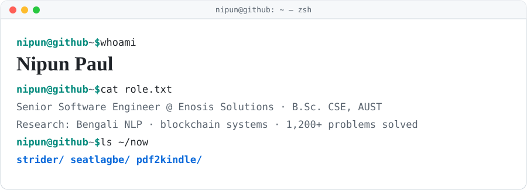
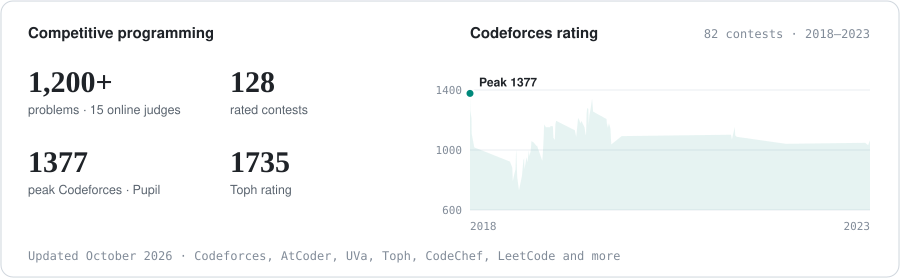

<picture>
  <source media="(prefers-color-scheme: dark)" srcset="assets/header-dark.svg">
  
</picture>

  <a href="https://nipun4338.github.io"><b>Portfolio</b></a> ·
  <a href="https://scholar.google.com/citations?user=xw0xI0wAAAAJ&hl=en">Google Scholar</a> ·
  <a href="https://www.linkedin.com/in/nipunpaul4338/">LinkedIn</a> ·
  <a href="https://nipun4338.github.io/Resources/NipunPaul_CV.pdf">CV</a> ·
  <a href="https://nipun4338.github.io/coding.html">Competitive programming</a> ·
  <a href="mailto:nipun4338@gmail.com">Email</a>

I build reliable, data-driven software. For 3+ years I have designed and shipped full-stack enterprise systems (project management, payment approval and workspace reservation) with **TypeScript, NestJS, React and PostgreSQL**. My research covers **Bengali NLP** and **blockchain-based systems**, and I am looking toward graduate study.

### 🔭 Now building

| Project | About |
|---|---|
| **Strider** · *private* | Strava-style GPS activity tracker. Segment efforts are matched with spatial SQL in **PostGIS** (timestamps live in the geometry’s M dimension); Expo / React Native app with background GPS; Banister fitness & fatigue model. |
| **SeatLagbe** · *private* | seats.io-style seat reservations for any venue: zoomable SVG seating charts, a “view from your seat” preview, uploadable floor plans and an analytics dashboard. React 19 · TypeScript · Vite. |
| [**pdf2kindle**](https://github.com/Nipun4338/pdf2kindle) | Turns Bengali, English or mixed PDFs into Kindle-ready EPUBs, fully offline: Tesseract OCR, legacy Bijoy → Unicode remapping, image fallback for pages that can’t reflow. |

### 📄 Research

- **Bengali-English Neural Machine Translation Using Deep Learning Techniques**: first author, *IEEE ECCE 2023* · [paper](https://doi.org/10.1109/ECCE57851.2023.10101491)
- **Decentralized Election System: Blockchain and Crypto Based Vote Transaction**: B.Sc. thesis, AUST · [details](https://nipun4338.github.io/thesis_research.html)

### ⭐ Selected projects

| Project | What it is | Stack |
|---|---|---|
| [CrowdCoin](https://github.com/Nipun4338/CrowdCoin) | Ethereum crowdfunding; spending needs majority approval from contributors | Solidity · Next.js · web3.js |
| [Cricket Results Analysis](https://github.com/Nipun4338/Bangladesh-Cricket-Match-Result-Analysis-before-and-after-Covid-19-Period-and-Win-Prediction) | Bangladesh cricket before/after Covid-19 and win prediction with five classifiers | Python · scikit-learn |
| [Joma Khoroch](https://github.com/Nipun4338/joma-khoroch) | Finance tracker with budget-velocity guidance and spending forecasts · [live](https://joma-khoroch.vercel.app/) | Next.js · PostgreSQL |
| [Beyond Earth](https://github.com/Nipun4338/beyond-earth) | Real-time space dashboard on NASA and launch APIs · [live](https://beyondearth.netlify.app/) | React |
| [DiaryMe](https://github.com/Nipun4338/diary) | Digital diary with a private vault and public stories · [live](https://diary-np.vercel.app/) | PHP · MySQL |
| [Boi](https://github.com/Nipun4338/boi) | Used-book marketplace with chat, comments and admin tools · [live](https://boi-seven.vercel.app) | PHP · MySQL |

More write-ups on the [projects page](https://nipun4338.github.io/projects.html).

### 🏆 Competitive programming

<picture>
  <source media="(prefers-color-scheme: dark)" srcset="assets/cp-card-dark.svg">
  
</picture>

ICPC Asia Dhaka Regional Preliminary 2019 **Honorable Mention** · Google Code Jam 2022 Round 1A · CODEWARE 2019 8th place

### 📊 Activity

  
  

The competitive-programming card refreshes daily from Codeforces, AtCoder, UVa, Toph, CodeChef, LeetCode and Timus via a GitHub Action in this repo.
